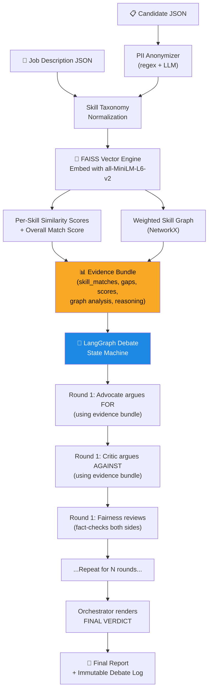

# Multi-Agent Candidate Evaluation System

An AI-powered hiring evaluation pipeline built with **LangChain + LangGraph** that takes a job description + candidate JSON, removes bias, normalizes skills, builds weighted skill graphs, uses **FAISS** for similarity scoring, runs a multi-agent debate (advocate vs critic, moderated by fairness agent, judged by orchestrator), and produces a transparent final report with immutable logs.

---

## How FAISS Connects to the Agents (End-to-End Flow)



### Key Insight: The Evidence Bundle

After FAISS embeddings are computed, we build an **Evidence Bundle** — a structured data package that becomes the shared context for all agents:

```python
evidence_bundle = {
    "overall_similarity": 0.82,           # FAISS cosine similarity (JD vs candidate)
    "skill_matches": [                     # Per-skill FAISS matches
        {"jd_skill": "python", "candidate_skill": "python", "similarity": 0.98},
        {"jd_skill": "kubernetes", "candidate_skill": "docker", "similarity": 0.71},
    ],
    "missing_skills": ["terraform", "aws"],  # From skill graph
    "extra_skills": ["redis", "graphql"],    # Candidate has, JD doesn't need
    "match_percentage": 75.0,                # Graph-based match %
    "experience_analysis": [...],            # Years required vs actual
    "graph_reasoning": [                     # Explicit reasoning strings
        "Candidate has 5yr Python, JD requires 3yr → exceeds requirement",
        "Candidate lacks Kubernetes, JD requires 2yr → critical gap",
    ]
}
```

Each agent receives this bundle and argues from their perspective:
- **Advocate** highlights the 0.98 Python match and extra skills
- **Critic** flags the missing Kubernetes/Terraform gaps
- **Fairness** verifies claims against actual data (e.g., "Critic says no Docker, but candidate actually has Docker at 0.71 similarity")

---

## Project Structure

```
p4/
├── .env                       ← GEMINI_API_KEY (gitignored)
├── .env.example               ← Template
├── config.py                  ← Settings loader (dotenv)
├── requirements.txt
├── main.py                    ← FastAPI server
├── run_pipeline.py            ← CLI demo runner
├── sample_data/
│   ├── sample_jd.json
│   └── sample_candidate.json
├── core/
│   ├── __init__.py
│   ├── anonymizer.py          ← PII redaction (regex + LangChain LLM chain)
│   ├── skill_taxonomy.py      ← Alias normalization
│   ├── skill_graph.py         ← Weighted NetworkX graph
│   ├── vector_engine.py       ← FAISS + sentence-transformers
│   └── cache.py               ← SHA-256 + LRU caching
├── agents/
│   ├── __init__.py
│   ├── advocate.py            ← LangChain agent: argues FOR
│   ├── critic.py              ← LangChain agent: argues AGAINST
│   ├── fairness.py            ← LangChain agent: fact-checker
│   ├── orchestrator.py        ← LangGraph state machine: runs debate
│   └── conversation_log.py    ← Append-only immutable log
├── report/
│   ├── __init__.py
│   └── generator.py           ← Final report builder
└── tests/
    ├── test_skill_taxonomy.py
    ├── test_anonymizer.py
    ├── test_vector_engine.py
    └── test_pipeline.py
```

---

## Tech Stack

| Component | Library | Why |
|---|---|---|
| Agent framework | **LangChain** | Composable chains, prompt templates, LLM wrappers |
| Agent orchestration | **LangGraph** | State machine for debate rounds, conditional routing |
| LLM | **Google Gemini** (`gemini-2.0-flash`) | Fast, capable, via `langchain-google-genai` |
| Vector similarity | **FAISS** (`faiss-cpu`) | Lightweight, fast, no server needed |
| Embeddings | **sentence-transformers** (`all-MiniLM-L6-v2`) | 384-dim, fast inference |
| Skill graph | **NetworkX** | Weighted directed graph |
| Caching | **cachetools** | LRU cache with hash keys |
| API | **FastAPI + Uvicorn** | Async endpoints |
| Config | **python-dotenv** | `.env` file for API keys |

---

## Module Details

### Core Modules

**`core/anonymizer.py`** — Dual-layer anonymization:
1. Regex: emails → `[EMAIL]`, phones → `[PHONE]`, addresses → `[ADDRESS]`
2. LangChain chain → Gemini to redact name, gender, age, ethnicity, university prestige

**`core/skill_taxonomy.py`** — 100+ alias map (`nodejs` → `node.js`, `react.js` → `react`, etc.)

**`core/vector_engine.py`** — Embeds JD & candidate skills with `all-MiniLM-L6-v2`, builds FAISS `IndexFlatIP`, returns per-skill similarity scores + overall match

**`core/skill_graph.py`** — NetworkX `DiGraph` with edges weighted by similarity score + experience years. Computes matched/missing/extra skills, generates reasoning strings.

**`core/cache.py`** — SHA-256 hash of `(jd + candidate)` → LRU cache. Decorator `@cached_evaluation` wraps the full pipeline.

### Agent System (LangChain + LangGraph)

**`agents/advocate.py`** — LangChain `ChatPromptTemplate` + Gemini. Receives evidence bundle, returns structured arguments for hiring.

**`agents/critic.py`** — Same pattern. Argues against hiring, identifies risks.

**`agents/fairness.py`** — Fact-checks both sides against the evidence bundle. Flags bias, ensures balanced debate.

**`agents/orchestrator.py`** — **LangGraph `StateGraph`** that defines the debate flow:

```python
# Simplified LangGraph state machine
class DebateState(TypedDict):
    evidence: dict
    rounds: list[dict]
    current_round: int
    advocate_args: list
    critic_args: list
    fairness_reviews: list
    verdict: str | None

graph = StateGraph(DebateState)
graph.add_node("advocate", advocate_node)
graph.add_node("critic", critic_node)
graph.add_node("fairness", fairness_node)
graph.add_node("judge", judge_node)

graph.add_edge(START, "advocate")
graph.add_edge("advocate", "critic")
graph.add_edge("critic", "fairness")
graph.add_conditional_edges("fairness", should_continue,
    {"continue": "advocate", "decide": "judge"})
graph.add_edge("judge", END)
```

**`agents/conversation_log.py`** — Append-only `LogEntry(timestamp, agent, content, round)`. No update/delete. Exports to markdown.

---

## API Endpoints

| Endpoint | Method | Purpose |
|---|---|---|
| `/evaluate` | POST | Full pipeline → returns report JSON |
| `/health` | GET | Health check |
| `/cache/stats` | GET | Cache hit/miss stats |

---

## Verification Plan

1. **Unit tests**: `python -m pytest tests/ -v`
2. **CLI demo**: `python run_pipeline.py` with sample data
3. **API test**: `uvicorn main:app --port 8000` → POST to `/evaluate`
